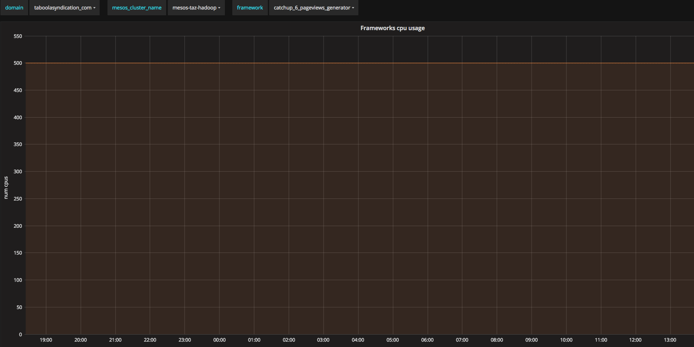

# Using Spark Dynamic Allocation on Mesos

## Environment
1. Spark v2.2.0
1. Mesos v1.1.0
1. Number of cores: thouthands
1. Number of mesos slaves: hundreds

The the story starts from metrics. You need to have some metric system that will show you that you are underutilizing your available resources. 
In Taboola, we are using Graphana and Metrictank and Kafka based pipeline to collect metrics. 
We have long running services that once in a while upon some external trigger start to process new chunks of data. In between the resources are not used, but no other framework can use them due to static allocation. Below you can see that number of cores taken from Mesos cluster are constant:



So our goal was two fold:
1. Utilize better available resources
1. Improve end-to-end processing time

One of the ways to release unused resources in static cluster(we are running on-premise) is to start using advanced spark feature of dynamic allocation.

## [What is dynamic allocation?](https://spark.apache.org/docs/latest/job-scheduling.html#configuration-and-setup) 
* Spark provides a mechanism to dynamically adjust the resources your application occupies based on the workload
* Your application may give resources back to the cluster if they are no longer used and request them again later when there is demand
* Particularly useful if multiple applications share resources in your Spark cluster

Since we've seen clear idle times we it seemed like perfect usecase for dynamic allocation. I've started to read about this feature and it seems that there are not many reports available out there. This one tries to fill the missing parts. The documentation on spark site is pretty limited. Moreover there is no discussion how it should be done in Mesos cluster environment. [Spark user list](http://apache-spark-user-list.1001560.n3.nabble.com/) lacks this information as well.

At basic level this is what happening: Spark driver monitors number of pending tasks. When there is no such, timeout timer starts to tick. If it expires the driver turns off executors on mesos slaves. The only problem with this approach is that killed executors produces some shuffle files that might be in need by other still-alive executors. To solve this issue, we need external shuffle service that will serve aforementioned shuffle files as a proxy of dead executor.

## Basic prerequisites
1. External Shuffle Service 
   1. Must run on every spark node
   1. Spark executor will connect to localhost:shuffle-service-port
   1. Spark executor will register itself and every shuffle files it produces
   1. External shuffle service will serve them to other executors if the source executor is killed
   1. spark.shuffle.service.enabled = true
1. Dynamic Allocation feature flag
   1. spark.dynamicAllocation.enabled = true

How to make sure external shuffle service is running on every mesos-slave node? Spark documentation mentions Marathon as a one way to achieve this(no more details).
   
## Mesos slaves reserve resources statically for "shuffle" role
1. Using [static reservation](http://mesos.apache.org/documentation/latest/reservation/) for the role, e.g.
```
--resources=cpus:10;mem:16000;ports:[31000-32000];cpus(shuffle):2;mem(shuffle):2048;ports(shuffle):[7337-7339]
```
1. You will see +2 cpus on every node(but usual frameworks won’t/can’t use those resources)
1. Marathon meta-framework:
1. Init.d for long running services on Mesos, provides HA
1. Uses statically reserved resources by service cli flag --mesos_role shuffle
1. E.g. http://sparktest001.taboolasyndication.com:8080/
1. Add alert for those services
1. Manage those with configuration service of your choice(chef/puppet/ansible etc)

## Marathon Service Shuffle files management
1. The most important thing - don’t delete shuffle files too soon
1. SPARK-12583 - solves problem of removing shuffles files too early by sending heartbeats to every external shuffle service
   1. Driver must register to all external shuffle services it had executors at
   1. Not always working, and there are similar reports about this as well. Opened SPARK-23286
1. At the end (even if fixed) not good for our use-case of long running spark services
   1. Framework “never” ends, so not clear when to remove files
1. We'have disabled cleanup by external shuffle service by -Dspark.shuffle.cleaner.interval=31557600
1. Installed simple cron job on every spark slave that cleans shuffle files that weren't touched more than X hours

## Marathon service descriptor
```
{
  "id": "/shuffle-service-7337",
  "cmd": "spark-2.2.0-bin-hadoop2.7/sbin/start-mesos-shuffle-service.sh",
  "cpus": 0.5,
  "mem": 1024,
  "instances": 20,
  "constraints": [["hostname", "UNIQUE"]],
  "acceptedResourceRoles": ["shuffle"],
  "uris": ["http://my-repo-endpoint/spark-2.2.0-bin-hadoop2.7.tgz"],
  "env": {
     "SPARK_NO_DAEMONIZE":"true",
     "SPARK_SHUFFLE_OPTS" : "-Dspark.shuffle.cleaner.interval=31557600 -Dspark.shuffle.service.port=7337 -Dspark.shuffle.service.enabled=true -Dspark.shuffle.io.connectionTimeout=300s",
     "SPARK_DAEMON_MEMORY": "1g",
     "SPARK_IDENT_STRING": "7337",
     "SPARK_PID_DIR": "/var/run",
     "SPARK_LOG_DIR": "/var/log/taboola",
     "PATH": "/usr/bin:/bin"
  },
  "portDefinitions": [{"protocol": "tcp", "port": 7337}],
  "requirePorts": true
}
```
1. Marathon supports [REST API](http://mesosphere.github.io/marathon/api-console/index.html):
```
curl -v localhost:8080/v2/apps -XPOST -H "Content-Type: application/json" -d'{...}’
```
1. *instances* are dynamically configured by periodic sensu check(you can use cron or anything else). 
   1. Using Mesos [REST-API](http://mesos.apache.org/documentation/latest/endpoints/master/slaves/) to find out active slaves
   1. Using Marathon REST-API to find out number of running tasks(instances) of given service
   1. Updating if necessary(both scaling down and scaling up)
1. Json descriptors are commited to git repo to maintain history
1. Up-to-dateness are verified by the same script by comparing most important fields in service descriptor and updating if necessary(REST API once again)

## Spark application config changes
1. spark.shuffle.service.enabled = true
1. spark.dynamicAllocation.enabled = true
1. spark.dynamicAllocation.executorIdleTimeout = 120s 
   1. when to kill executor
   1. Low value - fine granularity, but maybe livelocks
   1. High value - coarse granularity, bad sharing
1. spark.dynamicAllocation.cachedExecutorIdleTimeout = 120s
   1. infinite by default and may prevent scaling down
   1. it seems that broadcasted data falls into "cached" category
1. spark.shuffle.service.port = 7337
1. spark.dynamicAllocation.minExecutors = 1
1. spark.scheduler.listenerbus.eventqueue.size = 500000

## We still to discover external shuffle service tuning
1. Some of them available only at spark 2.3 : SPARK-20640
1. spark.shuffle.io.serverThreads
1. spark.shuffle.io.backLog 
1. spark.shuffle.service.index.cache.entries 

## Current status: running in production where it makes sense
1. 4 long running services with some dependency between each other, so 


